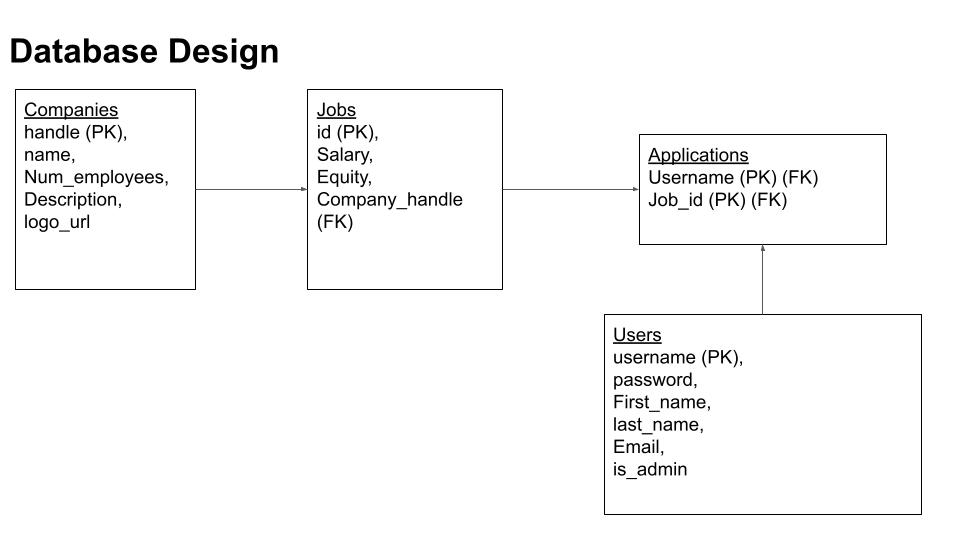

# Jobly
- Frontend: React
- Backend: express, postgresql

## Features Complete
- Login/Signup
- Users can: 
    - view companies, 
    - view jobs

## Getting Up & Running
### Backend
1. Node Environment Setup
    ```console
    $ npm install
    ```
2. Database Setup
    ```console
    $ psql
    =# CREATE DATABASE jobly;
    =# (control-d)
    psql db_name -f jobly.sql
    ```
3. Run the Server
    ```console
    $ npm start
    ```
4. Running Tests
     ```console
    $ jest test
    ```

### Frontend
1. Environment Setup
    ```console
    $ npm install
    ```
    
2. Run the Server
    ```console
    $ npm start
    ```
3. Running Tests
     ```console
    $ jest test
    ```

## Database Models


## React Component Diagram

